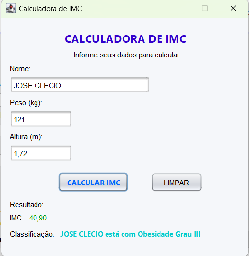

# Calculadora IMC

Projeto desenvolvido em Java utilizando Swing e Maven.

## Funcionalidades

* Cálculo automático do Índice de Massa Corporal (IMC)
* Classificação do resultado conforme os padrões da OMS
* Interface gráfica desenvolvida com Java Swing
* Tratamento de erros para entradas inválidas
* Limpeza dos campos com um clique

## Classificações

* Abaixo do peso
* Peso normal
* Sobrepeso
* Obesidade Grau I
* Obesidade Grau II
* Obesidade Grau III

## Tecnologias Utilizadas

* Java 21
* Swing
* Maven
* NetBeans

## Como Executar

1. Clone o repositório.
2. Abra o projeto no NetBeans.
3. Execute a classe principal `TelaImc`.

## Tela da Aplicação

## Autor

José Clecio Batista da Silva

Comissário de Polícia Civil de Pernambuco e estudante de Análise e Desenvolvimento de Sistemas (ADS).
